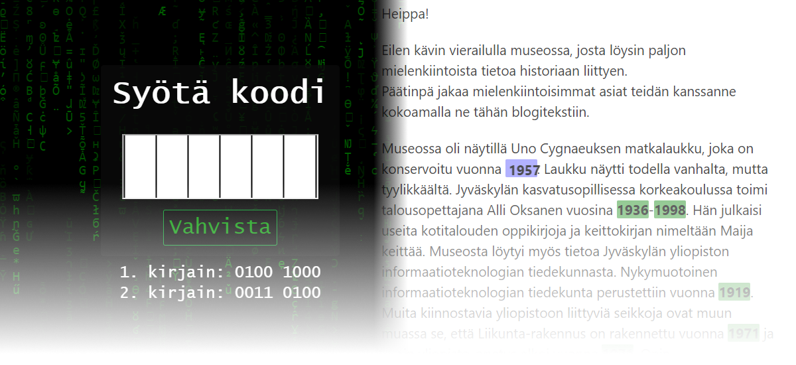

# Webpages for Myytinmurtajat 2019 camp

    

These are web pages for the Myytinmurtajat 2019 (Mythbusters) camp organized at the University of Jyväskylä. The pages were used as part of the IT workshop to play a simple hacking competition aimed children 7 to 9 years old.

In the workshop, the children attempt to solve a 6-character code. The first two letters are displayed on the main page as ASCII-encoded binary and the last two letters are displayed as part of special "news" task.

When the correct code is entered, the app displays a predefined URL (e.g. to a video or a reward).

This repo contains two pages: the page for entering the code (inside the `koodi` folder) and the page for the news task (inside the `news` folder).

## Installation

### Getting requirements

1. Install [Python 3.7](https://www.python.org/) and [enable a virtual environment](https://docs.python.org/3/library/venv.html)
2. Install the requirements by running `pip install -r requirements.txt` in this folder
3. (*If running on an IoT device under Linux*) Run `pip install PyBluez` and install Python Gattlib.

### Configuration

In both `koodi` and `news` folders, rename `.env.template` to `.env` and edit the file using the included comments as a guide.

### Debugging

To debug Koodi page, go to `koodi` and run `python debug.py`.  
To debug the News page, go to `news` and run `python debug.py`.

### Running the production version

In our setup we used [gunicorn](https://gunicorn.org/) to run the production version of the apps. Gunicorn is included in the `requirements.txt`. To run the app with gunicorn, use `wsgi:app` as the app module.

Make sure your working directory is `koodi` or `news` respectively when running the apps with gunicorn!

Note that `news` communicates with `koodi`, so it's advised to